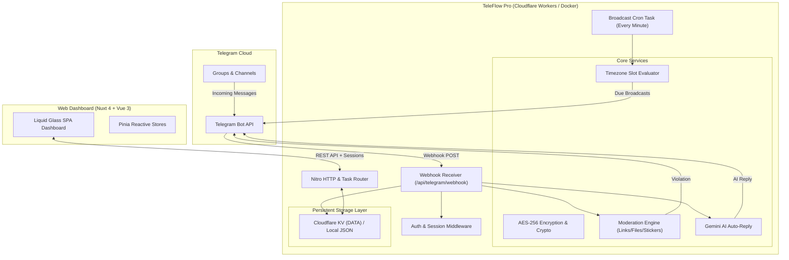

# ⚡ TeleFlow Pro — Advanced Telegram Bot Management Platform

<div align="center">


[](https://nuxt.com)
[](https://vuejs.org)
[](https://workers.cloudflare.com)
[](https://core.telegram.org/bots/api)
[](https://ai.google.dev)
[](https://www.typescriptlang.org)
[](LICENSE)

**TeleFlow Pro** is an enterprise-grade Telegram Bot Management & Automation Platform engineered with **Nuxt 4**, **Vue 3**, **Tailwind CSS**, **Pinia**, and **Nitro Server**. 

Deployable seamlessly to **Cloudflare Workers (Edge Serverless + KV)** or self-hosted via **Docker**, TeleFlow Pro gives teams full control over Telegram broadcasts, scheduled campaigns, community moderation, 2-way live chat, and AI-powered interactions.

[Explore Features](#-core-features) • [Quick Start](#-quick-start) • [Cloudflare Deployment](#-cloudflare-workers-deployment) • [Docker](#-docker-deployment) • [API Docs](#-api-endpoints)

</div>

---

## 🌟 Key Highlights

- 🎨 **Liquid Glass UI**: Ultra-modern frosted-glass dark & light interface with fluid animations and responsive layout.
- 💬 **Live 2-Way Group Chat**: Send and receive group messages in real time with photo, sticker, and media preview support.
- 🤖 **Multi-Bot & Encrypted Tokens**: Manage bot credentials secured via military-grade **AES-256-CBC** token encryption.
- 🧠 **Google Gemini AI Auto-Reply**: Context-aware AI responses triggered automatically on bot mentions and replies in group chats.
- 📅 **Smart Broadcast Scheduler**: Schedule one-time, daily, weekly, monthly, or cron broadcasts with native timezone formatting and a 10-minute missed-tick recovery grace window.
- 🛡️ **Community Moderation Shield**: Automated filtering of external links, spam stickers, and executable malware file extensions (60+ formats supported).
- ⚡ **Cloudflare Edge Native**: Runs at zero server cost on Cloudflare Workers using KV storage and Cron Triggers.
- 🔒 **Enterprise Authentication**: SHA-256 salted credentials with auto-rehash migrations, intelligent HTTPS session cookies, and multi-salt fallback.

---

## 🏗️ System Architecture



---

## 🚀 Core Features

### 1. 🤖 Bot Orchestration & Verification
- Real-time bot credential validation via `getMe` API.
- Displays bot ID, username, name, group permissions, and online connection status.
- Hardware-backed AES-256-CBC token encryption using WebCrypto (fully compatible with Cloudflare Workers and Node 20+).
- Support for multiple bot environments with automatic environment variable synchronization.

### 2. 💬 Live Telegram Group Chat & Sync
- Full Telegram-style interactive chat stream for all connected groups.
- Live chat name synchronization (detects group renames and supergroup migrations instantly).
- Media support: photo attachments, video previews, stickers, and reply-to message chaining.
- Real-time member registry tracking users and message frequency.

### 3. 🧠 Gemini AI Auto-Reply
- Powered by Google's Gemini models (`gemini-flash-latest`).
- Automatically generates intelligent replies when users @-mention the bot or reply to its messages.
- Customizable system prompts and max token limit directly from the dashboard.
- Encrypted API key management.

### 4. 📅 Smart Broadcast Scheduler
- **Schedule Types**: One-time, Daily, Weekly, Monthly, or custom 5-field Cron expressions.
- **Timezone Awareness**: Evaluated with `Intl.DateTimeFormat` (Phnom Penh, Bangkok, Singapore, Tokyo, UTC, etc.).
- **Grace Window Recovery**: Schedules remain eligible for 10 minutes following their target slot, preventing missed runs if edge cron ticks experience latency.
- **Target Selection**: Broadcast to all active groups or select specific target channels.
- **On-Demand Dispatch**: Test-fire or force-run any broadcast campaign instantly with `POST /api/schedules/run`.

### 5. 🛡️ Moderation Shield
- **Anti-Link Defense**: Automatically deletes messages containing unauthorized URLs and `t.me` invite links.
- **Anti-Sticker Defense**: Keeps chats clean from sticker flooding.
- **Malware Extension Filter**: Blocks 60+ dangerous extensions (`.exe`, `.bat`, `.scr`, `.apk`, `.vbs`, `.ps1`, etc.).
- Real-time audit log of all moderated messages with deletion confirmations.

### 6. 📊 Analytics & Audit Logs
- Comprehensive metrics: Total bots, active groups, messages dispatched, delivery success rates, and errors.
- Real-time searchable and filterable activity logs with detailed Telegram API error tracking.

---

## ⚡ Quick Start

### Prerequisites
- **Node.js**: v20.x or v22.x LTS
- **Package Manager**: `npm` (or `pnpm` / `yarn`)
- **Telegram Bot Token**: Created via [@BotFather](https://t.me/botfather)

### 1. Clone & Install
```bash
git clone https://github.com/NhebPanha/nn_panha_telegram_bot.git
cd nn_panha_telegram_bot
npm install
```

### 2. Configure Environment
Copy the configuration template:
```bash
cp .env.example .env
```
Edit `.env` and add your secrets:
```ini
ENCRYPTION_KEY=teleflow-ultra-secure-secret-encryption-key-32b
TELEGRAM_BOT_TOKEN=123456789:ABCdefGhIJKlmNoPQRsTUVwxyZ
TELEGRAM_GROUP_CHAT_ID=-1001234567890
WEBHOOK_SECRET=teleflow-webhook-secret-token
PUBLIC_URL=http://localhost:3000
GEMINI_API_KEY=your_gemini_api_key_here
```

### 3. Launch Development Server
```bash
npm run dev
```
Open [http://localhost:3000](http://localhost:3000) in your browser.

### 🔑 Default Credentials
| Field | Value |
| :--- | :--- |
| **Username** | `admin` |
| **Password** | `admin` **or** `abc@123` |

*(The password is automatically rehashed and upgraded to your active encryption key upon first sign in).*

---

## ☁️ Cloudflare Workers Deployment

TeleFlow Pro is pre-configured with the Nitro `cloudflare-module` preset for seamless edge execution.

### 1. Login to Cloudflare CLI
```bash
npx wrangler login
```

### 2. Create the KV Storage Namespace
```bash
npx wrangler kv namespace create DATA
```
Copy the output ID (e.g., `8f3a1c2d4b5e6f7890abcdef12345678`) into [`wrangler.toml`](file:///c:/Users/saml/Desktop/nn_panha_telegram_bot/wrangler.toml):
```toml
[[kv_namespaces]]
binding = "DATA"
id = "YOUR_KV_NAMESPACE_ID"
```

### 3. Set Production Secrets
```bash
npx wrangler secret put NUXT_ENCRYPTION_KEY
npx wrangler secret put NUXT_WEBHOOK_SECRET
npx wrangler secret put NUXT_TELEGRAM_BOT_TOKEN
npx wrangler secret put NUXT_GEMINI_API_KEY
```

### 4. Build & Deploy
```bash
npm run build
npx wrangler deploy
```

### 5. Activate Telegram Webhook
Once deployed, click **Set Webhook** in the dashboard Bot Settings panel, or send a POST request:
```bash
curl -X POST https://your-worker.workers.dev/api/telegram/webhook-setup
```

---

## 🐳 Docker Deployment

Self-host TeleFlow Pro on any VPS or local server with Docker:

### 1-Click Launch with Docker Compose
```bash
docker compose up -d --build
```
The application will be accessible at `http://localhost:3000`, with database storage persisted in the `./data` directory.

---

## 📡 API Endpoints

All protected endpoints require an active session cookie (`teleflow_session`).

| Method | Endpoint | Description | Auth Required |
| :--- | :--- | :--- | :---: |
| `GET` | `/api/health` | Health check, uptime & service status | ❌ |
| `POST` | `/api/auth/login` | Authenticate administrator session | ❌ |
| `POST` | `/api/auth/logout` | Terminate active session | ✅ |
| `GET` | `/api/auth/me` | Get authenticated user info | ✅ |
| `GET` | `/api/bot` | Fetch configured bot details | ✅ |
| `POST` | `/api/bot` | Register new bot token | ✅ |
| `POST` | `/api/bot/verify` | Test Telegram API token connection | ✅ |
| `GET` | `/api/dashboard/stats` | Aggregated system metrics | ✅ |
| `GET` | `/api/groups` | List all connected groups | ✅ |
| `POST` | `/api/groups` | Add new target group or channel | ✅ |
| `GET` | `/api/groups/:id/messages` | Fetch group chat conversation stream | ✅ |
| `POST` | `/api/groups/:id/messages` | Send message from dashboard to group | ✅ |
| `GET` | `/api/schedules` | List recurring and one-time broadcasts | ✅ |
| `POST` | `/api/schedules` | Create new broadcast campaign | ✅ |
| `POST` | `/api/schedules/run` | Execute scheduler tick on demand | ✅ |
| `GET` | `/api/moderation` | Retrieve moderation filters | ✅ |
| `PUT` | `/api/moderation` | Update link/sticker/file filter rules | ✅ |
| `GET` | `/api/ai` | Fetch Gemini AI reply configuration | ✅ |
| `PUT` | `/api/ai` | Update prompt, model, and API key | ✅ |
| `POST` | `/api/telegram/webhook` | Telegram Bot API incoming update webhook | Secret Token |
| `POST` | `/api/telegram/webhook-setup`| Register public URL with Telegram API | ✅ |

---

## 🔒 Security Architecture

- **Token Encryption**: Bot tokens are encrypted using standard **AES-256-CBC** with a unique random initialization vector (IV) per token (`<iv-hex>:<ciphertext-hex>`).
- **Password Protection**: Passwords are encrypted with SHA-256 and salted with your private `ENCRYPTION_KEY`.
- **Session Security**: Cookies are flagged `HttpOnly`, `SameSite=Lax`, and dynamically detect HTTPS on edge proxies to avoid insecure transport.
- **Webhook Integrity**: Incoming Telegram updates are validated against the `X-Telegram-Bot-Api-Secret-Token` header.

---

## 🛠️ Tech Stack

| Technology | Purpose |
| :--- | :--- |
| **Nuxt 4** | Full-stack Vue framework & directory structure |
| **Nitro** | Universal server engine with Cloudflare Workers preset |
| **Vue 3** | Composition API & reactive frontend architecture |
| **Tailwind CSS** | Liquid Glass design styling & responsive layouts |
| **Pinia** | State management for bots, chats, groups, and logs |
| **Cloudflare KV** | Globally distributed serverless key-value persistence |
| **Google Gemini** | Generative AI for automated conversational replies |
| **Lucide Vue** | Crisp modern SVG interface iconography |

---

## 📄 License

This project is licensed under the **MIT License**. See the [LICENSE](LICENSE) file for details.

---

<div align="center">

**Developed with ❤️ by [Nheb Panha](https://github.com/NhebPanha)**

*Empowering automated Telegram operations and intelligent community management.*

</div>
